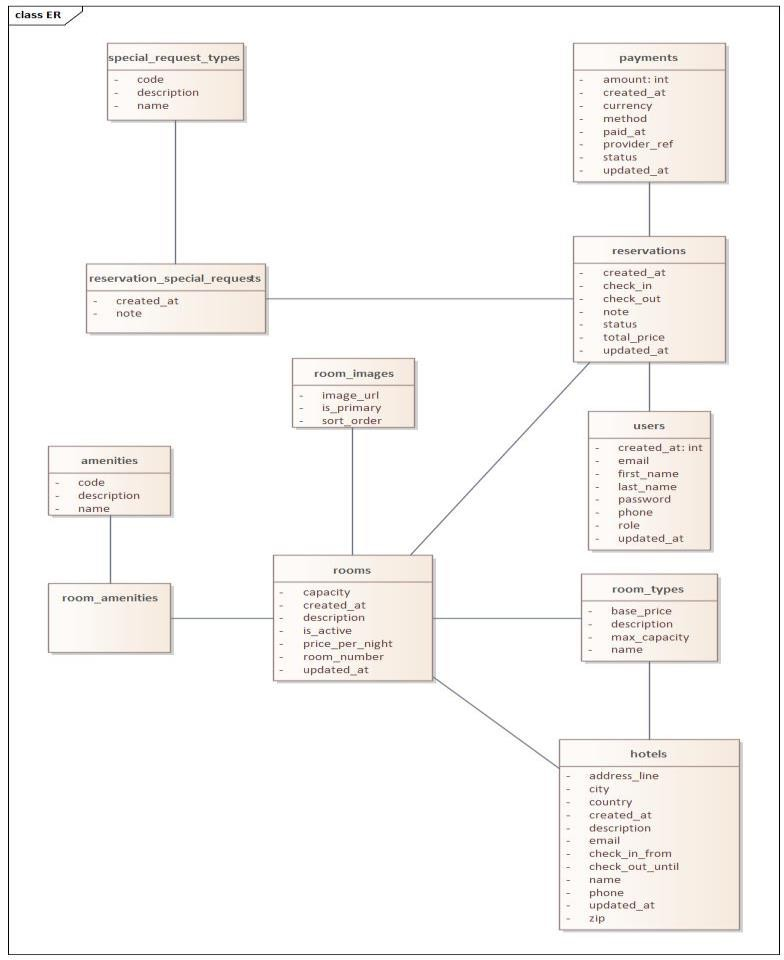
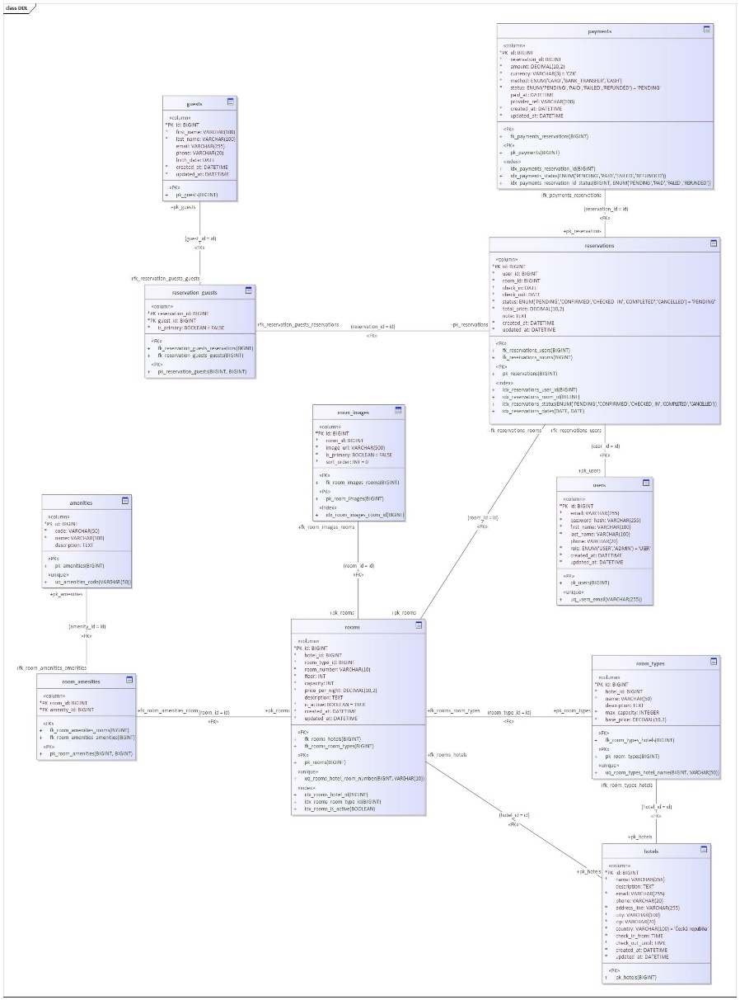
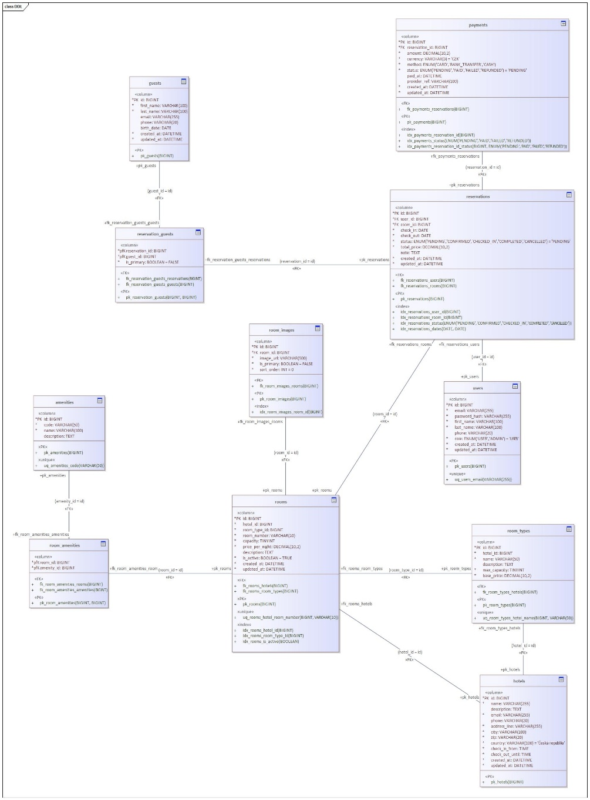
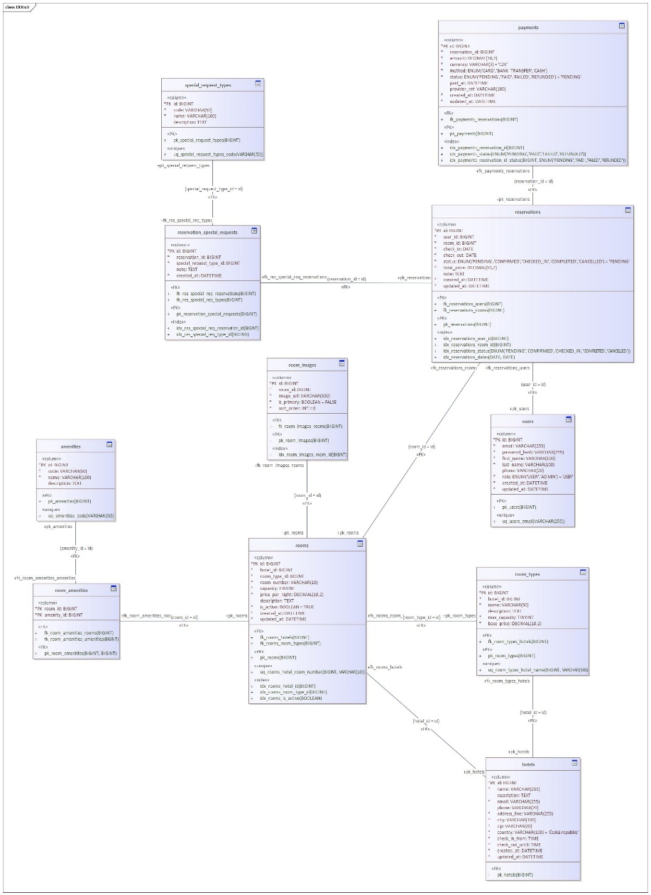
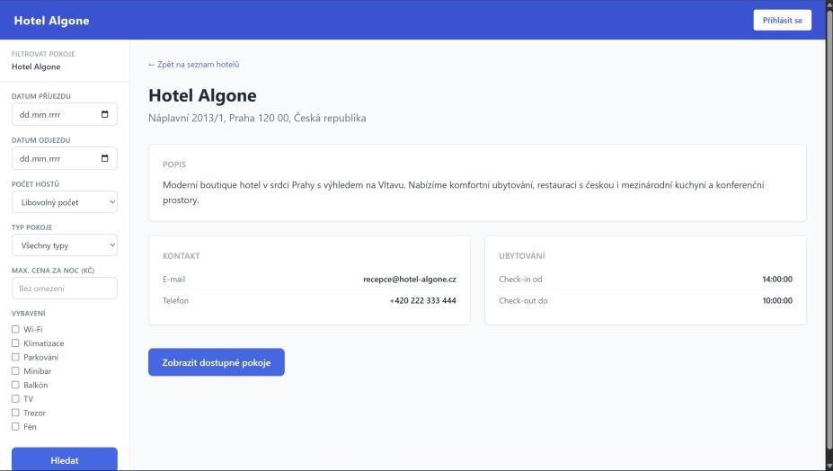
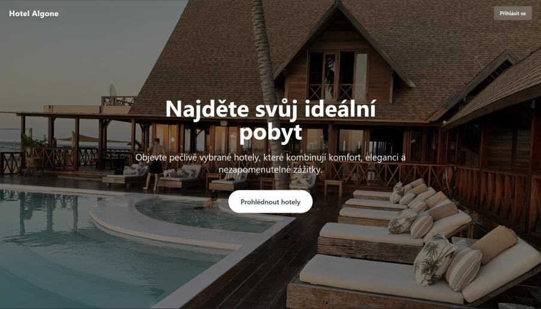
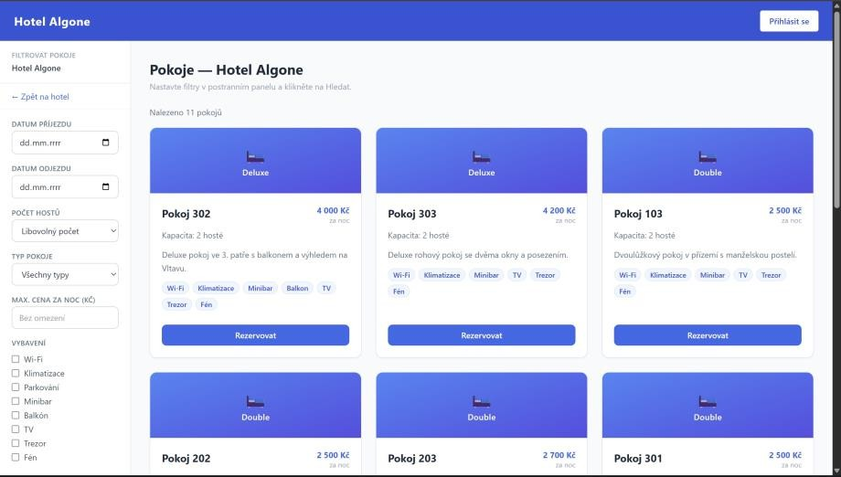
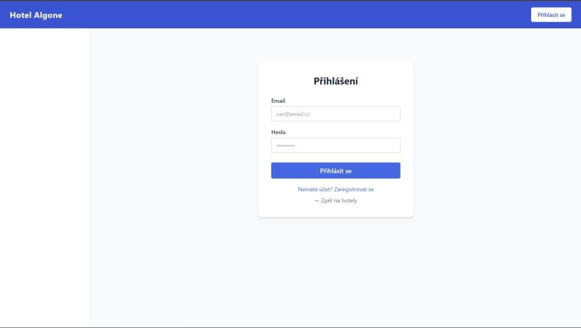
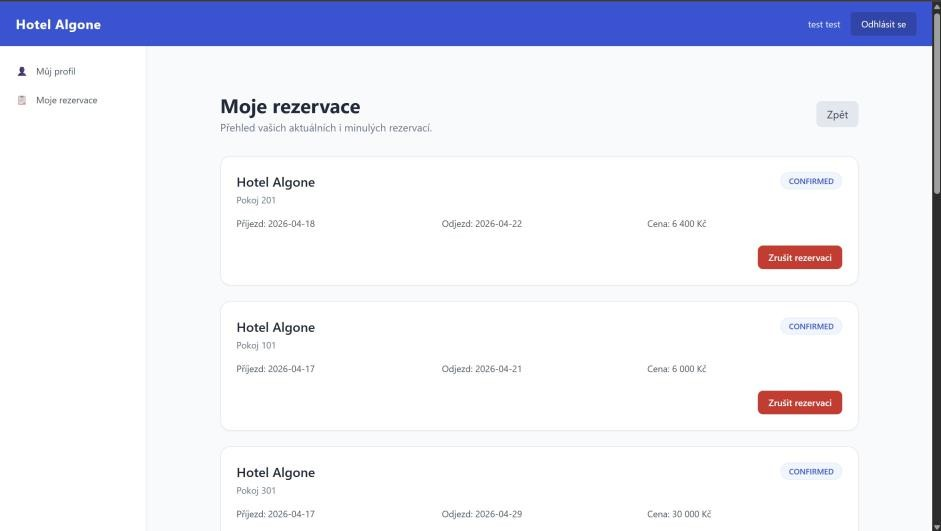
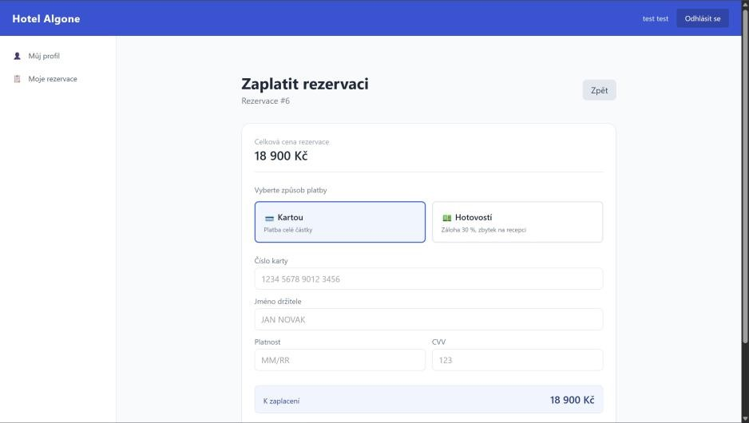

# UNIVERZITA Hradec Králové
Fakulta informatiky a managementu

# Algone Reservations

Seminární práce z předmětu Databázové systémy 2

Členové pracovního týmu: Jitka Čabelická, Václav Gabriel

V Hradci Králové

dne 10. 5. 2026

### Obsah

Obsah 2

Úvod 3

Zadání 4

Uživatelská dokumentace 5

Základní popis používané aplikace 6

Instalace 6

Přístupová oprávnění 7

Použití aplikace 7

Programová dokumentace 9

Datová část 10

Analýza 10

Fyzický model dat 15

Číselníky 16

Pohledy 17

Funkce 17

Uložené procedury 18

Spouště 18

Indexy 18

Sekvence 19

Aplikace 20

Použité prostředí 23

Řízení uživatelských účtů 25

Moduly 25

Formuláře 26

Orientace ve zdrojovém kódu 26

Závěr 29

Závěr 30

Přílohy 31

Backup databáze 31

Součástí odevzdání je databázový backup uložený v souboru: 31

docs/backup_algone_reservations.sql 31

Backup lze v případě potřeby znovu vytvořit například příkazem: 31

docker exec algone-mysql mysqldump -u root -proot algone_reservations > backup_algone_reservations.sql 31

Pokud není použit Docker, lze použít lokální nástroj mysqldump: 31

mysqldump -u root -p algone_reservations > backup_algone_reservations.sql 31

Zdrojové kódy aplikace, grafika, apod. 31

Zdrojové kódy jsou odevzdány jako součást projektu. Backendová část je ve složce reservations-server a frontendová část ve složce reservations-front. 31

Dokumentace a diagramy jsou uloženy ve složce docs. 31

Případně ostatní 31

### Úvod

Projekt Algone Reservations je webová databázová aplikace pro správu hotelových rezervací. Vychází z modelové situace malého hotelu, který dosud eviduje rezervace ručně přes telefon, e-mail a tabulkové soubory. Cílem projektu je nahradit ruční evidenci centrálním rezervačním systémem s databází MySQL, veřejnou částí pro hosty a administrátorským rozhraním pro správce hotelu.

Aplikace řeší katalog hotelu a pokojů, registraci a přihlášení uživatelů, tvorbu rezervací, platby k rezervacím a administrátorskou správu rezervací, uživatelů, pokojů a plateb. Systém je rozdělen na backendovou část ve Spring Bootu, frontendovou část ve vanilla JavaScript SPA a databázovou část spravovanou pomocí Flyway migrací.

### Zadání

Zadáním bylo vytvořit hotelový rezervační systém nad relační databází. Aplikace má umožnit veřejnému uživateli prohlížet hotel a dostupné pokoje, registrovat se, přihlásit se, vytvořit rezervaci a zaplatit ji. Přihlášený uživatel má mít přístup ke svému profilu a svým rezervacím.

Administrátor má mít možnost spravovat provozní data hotelu. V implementaci jsou připraveny administrátorské části pro rezervace, uživatele, pokoje a platby. Admin může měnit stav rezervací podle stavového automatu, spravovat uživatele, vytvářet a upravovat pokoje, aktivovat nebo deaktivovat pokoje a měnit stav plateb podle povolených přechodů.

Sledované údaje:

hotely: název, popis, kontakt, adresa, časy příjezdu a odjezdu,

uživatelé: e-mail, hash hesla, jméno, příjmení, telefon, role,

typy pokojů: hotel, název, popis, maximální kapacita, základní cena,

pokoje: hotel, typ pokoje, číslo, kapacita, cena za noc, popis, aktivita,

vybavení: kód, název, popis a vazba na pokoje,

rezervace: uživatel, pokoj, datum příjezdu a odjezdu, stav, cena, poznámka,

platby: rezervace, částka, měna, metoda, stav, čas zaplacení, reference poskytovatele,

speciální požadavky: číselník požadavků a vazba na rezervaci.

Vstupy aplikace tvoří registrační a přihlašovací údaje, parametry vyhledávání pokojů, údaje pro vytvoření rezervace, údaje pro platbu a administrátorské formuláře pro správu pokojů a stavů. Výstupy tvoří katalog hotelů a pokojů, přehled rezervací, přehled plateb, administrátorské tabulky a odpovědi REST API.

## Uživatelská dokumentace

#### Základní popis používané aplikace

Algone Reservations je webová aplikace pro rezervaci pokojů v hotelu. Hosté mohou procházet nabídku, filtrovat dostupné pokoje, vytvořit účet, vytvořit rezervaci a zaplatit ji. Administrátor spravuje rezervace, uživatele, pokoje a platby. Aplikace neřeší skutečné napojení na platební bránu; platba je v semestrálním projektu simulována a ukládána do databáze.

#### Instalace

Java 17 nebo novější,

Maven,

Docker Desktop nebo lokální MySQL 8,

moderní webový prohlížeč (Chrome, Firefox),

volitelně IntelliJ IDEA / VS Code.

Postup spuštění databáze:

V kořenové složce projektu spustit `docker compose up -d`.

Docker vytvoří kontejner `algone-mysql`, databázi `algone_reservations` a root heslo `root`.

Flyway migrace se aplikují při startu backendu.

Postup spuštění backendu:

Přejít do složky `reservations-server`.

Spustit `mvn spring-boot:run`.

Backend běží na `http://localhost:8080`.

REST API používá prefix `http://localhost:8080/api`.

Postup spuštění frontendu:

Přejít do složky `reservations-front`.

Spustit jednoduchý statický server, například přes libovolný HTTP server.

Frontend otevřít v prohlížeči na `http://localhost:5173` nebo jiném zvoleném portu.

Databázové připojení pro lokální vývoj:

host: `localhost`,

port: `3306`,

databáze: `algone_reservations`,

uživatel: `root`,

heslo: `root`.

#### Přístupová oprávnění

Aplikace používá role `ANONYMOUS`, `USER` a `ADMIN`.

Nepřihlášený uživatel může prohlížet veřejnou část aplikace, hotely a pokoje, přihlásit se a registrovat se. Role `USER` může spravovat svůj profil, vytvářet rezervace, prohlížet svoje rezervace a platby. Role `ADMIN` má přístup do administrace, spravuje rezervace, uživatele, pokoje a platby.

Ukázkový administrátorský účet ze seed dat:

e-mail: `admin@test.com`,

heslo: `admin123`.

Běžného uživatele lze vytvořit přes registrační formulář v aplikaci. Hesla jsou na backendu ukládána jako BCrypt hash, nikoli jako otevřený text.

#### Použití aplikace

Veřejná část:

Uživatel otevře aplikaci.

Na úvodní stránce vidí hotel a může přejít na detail.

V detailu nebo seznamu pokojů může filtrovat podle termínu, kapacity, ceny, typu pokoje a vybavení.

Pro vytvoření rezervace se uživatel musí přihlásit nebo registrovat.

Registrace a přihlášení:

Uživatel vyplní jméno, příjmení, e-mail a heslo.

Po přihlášení dostane JWT token, který frontend přikládá k API požadavkům.

Přihlášený uživatel může přejít na profil, upravit profil, e-mail nebo heslo.

Rezervace:

Uživatel vybere pokoj a vytvoří rezervaci.

Backend zkontroluje dostupnost pokoje, aktivitu pokoje a kolize termínů.

Rezervace vzniká ve stavu `PENDING`.

Uživatel vidí svoje rezervace v přehledu.

Platby:

Uživatel otevře platby u své rezervace.

Vybere metodu platby.

U platby kartou se hradí celá částka, u hotovosti se počítá záloha 30 %.

Po úspěšné platbě je rezervace potvrzena.

Administrace:

Admin se přihlásí účtem `admin@test.com / admin123`.

V levém menu vidí položky `Správa`, `Rezervace`, `Uživatelé` a `Pokoje`.

V rezervacích může filtrovat podle stavu, měnit stav rezervace a otevřít platby.

V uživatelích vidí tabulku registrovaných účtů a může smazat cizí účet, pokud nemá navázané rezervace.

V pokojích může filtrovat podle hotelu, vytvořit nový pokoj, upravit pokoj a přepínat aktivitu pokoje.

V platbách může admin měnit stav platby jen podle povoleného stavového automatu.

## Programová dokumentace

### Datová část

Databáze je relační, běží na MySQL 8 a používá engine InnoDB. Schéma je spravováno přes Flyway migrace v adresáři `reservations-server/src/main/resources/db/migration`. Hibernate má nastaveno `ddl-auto=validate`, takže neschvaluje automatické úpravy schématu, ale pouze kontroluje soulad entit s databází.

Databázový model má 11 hlavních tabulek:

- `hotels`,
- `users`,
- `room_types`,
- `rooms`,
- `room_images`,
- `amenities`,
- `room_amenities`,
- `reservations`,
- `payments`,
- `special_request_types`,
- `reservation_special_requests`.

#### Analýza

Hlavní entitou systému je hotel. Hotel má typy pokojů a konkrétní pokoje. Pokoj patří jednomu hotelu a jednomu typu pokoje, ale může mít více vybavení přes spojovací tabulku `room_amenities`. Uživatel vytváří rezervace konkrétního pokoje v určitém termínu. Rezervace má jeden stav ze stavového automatu a může mít více plateb. Volitelně může mít také speciální požadavky.

ER diagram je uložen v projektu jako `docs/DDL/ER.jpg`. Další vývojové verze diagramu jsou v `docs/DDL/DDL_v1.jpg`, `docs/DDL/DDL_v2.jpg` a `docs/DDL/DDL_v3.jpg`.

Charakter uživatelského rozhraní:

veřejný katalog hotelů a pokojů,

formuláře registrace a přihlášení,

profil uživatele,

formulář vytvoření rezervace,

obrazovka plateb,

administrátorské tabulky rezervací, uživatelů a pokojů,

administrátorský formulář pokoje.

Logický datový model

Vazby mezi entitami:

- `hotels` 1:N `room_types`,
- `hotels` 1:N `rooms`,
- `room_types` 1:N `rooms`,
- `rooms` 1:N `room_images`,
- `rooms` M:N `amenities` přes `room_amenities`,
- `users` 1:N `reservations`,
- `rooms` 1:N `reservations`,
- `reservations` 1:N `payments`,
- `reservations` 1:N `reservation_special_requests`,
- `special_request_types` 1:N `reservation_special_requests`.

Stavový automat rezervací:

- `PENDING` → `CONFIRMED`,
- `PENDING` → `CANCELLED`,
- `CONFIRMED` → `CHECKED_IN`,
- `CONFIRMED` → `CANCELLED`,
- `CHECKED_IN` → `COMPLETED`,
- `CHECKED_IN` → `CANCELLED`.

Koncové stavy rezervace jsou `COMPLETED` a `CANCELLED`.

Stavový automat plateb:

- `PENDING` → `PAID`,
- `PENDING` → `FAILED`,
- `PAID` → `REFUNDED`.

Stavy `FAILED` a `REFUNDED` jsou koncové.

#### Fyzický model dat

Fyzický model je definován SQL migracemi `V1` až `V16`. Primární klíče jsou typu `BIGINT AUTO_INCREMENT`. Cizí klíče jsou definovány samostatnými constraints. Textové hodnoty používají typy `VARCHAR` a `TEXT`, ceny jsou v `DECIMAL(10,2)`, termíny v `DATE` nebo `DATETIME` a stavy v MySQL `ENUM`.

Vybrané tabulky:

`hotels`: základní údaje hotelu a kontakty,

`users`: účty uživatelů s unikátním e-mailem a rolí,

- `rooms`: konkrétní pokoje, unikátní kombinace `hotel_id + room_number`,

`reservations`: rezervace s termínem, stavem a celkovou cenou,

`payments`: platby k rezervaci s metodou a stavem,

`room_amenities`: vazba M:N mezi pokoji a vybavením.

Datový slovník a kompletní DDL jsou v souboru `docs/schema_for_ea.sql` a v migracích ve složce `reservations-server/src/main/resources/db/migration`.

#### Číselníky

Projekt používá tyto číselníky:

`room_types`: typy pokojů pro konkrétní hotel, například Single, Double, Suite, Deluxe,

`amenities`: vybavení pokojů, například WIFI, PARKING, AC, MINIBAR, BALCONY, TV, SAFE, HAIRDRYER,

`special_request_types`: typy speciálních požadavků, například EXTRA_BED, LATE_CHECKOUT, EARLY_CHECKIN, BABY_COT.

Číselníky jsou seedovány ve Flyway migraci `V12__seed_data.sql`.

#### Pohledy

Databáze používá pohled `v_active_reservations`. Pohled vrací aktivní rezervace, tedy rezervace, které nejsou ve stavech `CANCELLED` ani `COMPLETED`. Připojuje informace o uživateli, pokoji, typu pokoje a hotelu.

Zjednodušené SQL:

CREATE VIEW v_active_reservations AS

SELECT r.id AS reservation_id, r.check_in, r.check_out, r.status,

r.total_price, u.id AS user_id,

CONCAT(u.first_name, ' ', u.last_name) AS guest_name,

rm.id AS room_id, rm.room_number, rt.name AS room_type,

h.id AS hotel_id, h.name AS hotel_name

FROM reservations r

JOIN users u ON u.id = r.user_id

JOIN rooms rm ON rm.id = r.room_id

JOIN room_types rt ON rt.id = rm.room_type_id

JOIN hotels h ON h.id = rm.hotel_id

WHERE r.status NOT IN ('CANCELLED', 'COMPLETED');

Úplná definice je v migraci `V13__create_view_active_reservations.sql`.

#### Funkce

Databáze používá funkci `fn_calculate_total_price(room_id, check_in, check_out)`. Funkce načte cenu pokoje za noc, spočítá počet nocí pomocí `DATEDIFF` a vrátí celkovou cenu.

Účel funkce:

- centralizovat výpočet ceny na úrovni databáze,
- zajistit konzistentní výpočet pro rezervace,
- splnit požadavek na použití databázové funkce.

Úplná definice je v migraci `V14__create_function_calculate_total_price.sql`.

#### Uložené procedury

Databáze používá proceduru `sp_cancel_expired_reservations(p_days)`. Procedura hromadně ruší rezervace ve stavu `PENDING`, které jsou starší než zadaný počet dnů.

Zjednodušené SQL:

UPDATE reservations

SET status = 'CANCELLED'

WHERE status = 'PENDING'

AND created_at < DATE_SUB(NOW(), INTERVAL p_days DAY);

Úplná definice je v migraci `V15__create_procedure_cancel_expired_reservations.sql`.

#### Spouště

Databáze používá trigger `trg_payment_set_paid_at`. Trigger se spouští před aktualizací tabulky `payments`. Pokud platba přechází do stavu `PAID` a `paid_at` je prázdné, doplní aktuální čas.

Účel triggeru:

automaticky doplnit datum zaplacení,

nepřenášet tuto odpovědnost na frontend,

zachovat konzistenci dat i při změně stavu platby administrátorem.

Úplná definice je v migraci `V16__create_trigger_payment_set_paid_at.sql`.

#### Indexy

Použité indexy a unikátní omezení:

`users.email`: unikátní e-mail uživatele,

`room_types(hotel_id, name)`: unikátní typ pokoje v rámci hotelu,

`rooms(hotel_id, room_number)`: unikátní číslo pokoje v rámci hotelu,

- `rooms.hotel_id`, `rooms.room_type_id`, `rooms.is_active`,
- `room_images.room_id`,
- `reservations.user_id`, `reservations.room_id`, `reservations.status`, `reservations(check_in, check_out)`,
- `payments.reservation_id`, `payments.status`, `payments(reservation_id, status)`,
- `special_request_types.code`,
- `reservation_special_requests.reservation_id`, `reservation_special_requests.special_request_type_id`.

Indexy podporují rychlé vyhledávání dostupných pokojů, filtrování rezervací a plateb a kontrolu unikátních business pravidel.

#### Sekvence

MySQL v projektu nepoužívá samostatné sekvence. Identifikátory jsou generovány pomocí `AUTO_INCREMENT` na primárních klíčích tabulek. V JPA entitách tomu odpovídá anotace `@GeneratedValue(strategy = GenerationType.IDENTITY)`.

### Aplikace

Výsledná aplikace Algone Reservations je webový rezervační systém pro správu hotelových pokojů, rezervací, plateb a uživatelů. Aplikace je rozdělena na veřejnou část pro návštěvníky, uživatelskou část pro přihlášené zákazníky a administrátorskou část pro správce systému.

Veřejná část aplikace umožňuje zobrazit nabídku hotelu a dostupných pokojů. Uživatel může procházet pokoje, zobrazit detail pokoje a po registraci nebo přihlášení vytvořit rezervaci.

Po přihlášení má uživatel přístup ke svému účtu, kde může zobrazit své rezervace. U rezervace je možné sledovat její stav a zobrazit související platby. Platba je v rámci semestrálního projektu simulována a ukládána do databáze.

Administrátorská část je dostupná pouze uživatelům s rolí ADMIN. Po přihlášení administrátora se zobrazí administrační dashboard, ze kterého je možné přejít do správy rezervací, uživatelů a pokojů.

Ve správě rezervací administrátor vidí seznam všech rezervací v systému. Rezervace lze filtrovat podle stavu a měnit jejich stav podle povoleného stavového automatu. Díky tomu nelze provést neplatný přechod stavu rezervace.

Ve správě uživatelů administrátor vidí registrované uživatele včetně jejich e-mailu, jména, příjmení, role a data vytvoření. Uživatelé mohou být odstraněni, pokud tomu nebrání vazby v databázi, například existující rezervace.

Ve správě pokojů může administrátor zobrazit seznam pokojů, vytvořit nový pokoj, upravit existující pokoj a aktivovat nebo deaktivovat pokoj. Formulář pokoje obsahuje výběr hotelu, typu pokoje, číslo pokoje, kapacitu, cenu za noc, popis, aktivitu a vybavení pokoje.

U plateb může administrátor měnit stav platby podle povoleného stavového automatu. Povolené přechody jsou například ze stavu PENDING na PAID nebo FAILED a ze stavu PAID na REFUNDED. Nepovolené změny jsou blokovány na frontendové i backendové části.

Aplikace tak pokrývá hlavní požadavky zadání: evidenci hotelu a pokojů, registraci a přihlášení uživatelů, tvorbu rezervací, evidenci plateb a administrátorskou správu provozních dat.

#### Použité prostředí

Použité prostředí

Backend:

Java 17,

Spring Boot 3.2.3,

Spring Web,

Spring Data JPA,

Spring Security,

JWT knihovna `jjwt`,

Flyway,

MySQL Connector/J,

Lombok,

Maven.

Frontend:

HTML,

Tailwind CSS přes CDN / utility třídy,

vanilla JavaScript,

vlastní SPA router,

vlastní state management inspirovaný Flux/Redux principem.

Databáze:

MySQL 8,

Flyway migrace,

Docker Compose pro lokální běh databáze.

#### Řízení uživatelských účtů

Uživatelské účty jsou uloženy v tabulce `users`. Autentizace probíhá přes e-mail a heslo. Heslo se ukládá jako BCrypt hash. Po úspěšném přihlášení backend vrátí JWT token. Frontend token ukládá do stavu aplikace a posílá ho v hlavičce `Authorization: Bearer ...`.

Autorizace je role-based access control. Role jsou:

`USER`: běžný uživatel,

`ADMIN`: administrátor,

`ANONYMOUS`: nepřihlášený stav na frontendu.

Backend chrání administrátorské endpointy prefixem `/api/admin/**` a zároveň používá `@PreAuthorize("hasRole('ADMIN')")` na admin controllerech.

#### Moduly

Backendové moduly:

`controller`: REST controllery,

`service`: business logika a transakce,

`repository`: JPA repository s JPQL dotazy,

`entity`: JPA entity mapované na tabulky,

`dto/request`: request DTO s validacemi,

`dto/response`: response DTO,

`exception`: centrální zpracování chyb,

`security`: JWT autentizace a autorizace,

`config`: bezpečnost a web konfigurace.

Frontendové moduly:

`state`: centrální stav aplikace,

`actions`: aplikační akce a API volání,

`dispatcher`: rozcestník akcí,

`selectors`: příprava dat pro pohledy,

`handlers`: továrna na DOM event handlery,

`router`: hash router,

`views/pages`: stránky aplikace,

`views/components`: sdílené komponenty,

`infrastructure`: API klient a store.

#### Formuláře

Aplikace obsahuje tyto hlavní formuláře:

registrace uživatele,

přihlášení,

úprava profilu,

změna e-mailu,

změna hesla,

filtr pokojů,

vytvoření rezervace,

platební formulář,

administrátorská změna stavu rezervace,

administrátorský formulář pokoje,

administrátorská změna stavu platby.

Validace probíhá na frontendu kvůli uživatelskému komfortu a na backendu kvůli bezpečnosti a konzistenci. Backend je autoritativní.

#### Orientace ve zdrojovém kódu

Kořen projektu:

`reservations-server`: backend Spring Boot,

`reservations-front`: frontend SPA,

`docs`: dokumentace, diagramy a databázový model,

`docker-compose.yml`: lokální MySQL,

`.gitignore`: ignorované soubory.

Důležité backendové soubory:

`SecurityConfig.java`: konfigurace zabezpečení,

`AuthController.java` a `AuthService.java`: registrace a přihlášení,

`RoomController.java` a `RoomService.java`: veřejné pokoje,

`AdminRoomController.java` a `RoomService.java`: administrace pokojů,

`ReservationController.java`, `AdminReservationController.java`, `ReservationService.java`: rezervace,

`PaymentController.java`, `PaymentService.java`: platby,

`AdminUserController.java`, `AdminUserService.java`: administrace uživatelů,

`GlobalExceptionHandler.java`: jednotné chybové odpovědi.

Důležité frontendové soubory:

`app.js`: inicializace aplikace,

`router/router.js`: mapování URL na akce,

`dispatcher/dispatcher.js`: zpracování akcí,

`state/state.js`: výchozí stav,

`selectors/selectors.js`: view-state selektory,

`handlers/createHandlers.js`: handlery,

`views/render.js`: výběr pohledu,

`views/pages/AdminUsersView.js`: administrace uživatelů,

`views/pages/AdminRoomsView.js`: seznam pokojů,

`views/pages/AdminRoomFormView.js`: formulář pokoje,

`views/pages/ReservationPaymentsView.js`: platby uživatele i admina.

API endpointy

Vybrané veřejné endpointy:

- `POST /api/auth/register`,
- `POST /api/auth/login`,
- `GET /api/hotels`,
- `GET /api/hotels/{id}`,
- `GET /api/rooms`,
- `GET /api/room-types?hotelId=...`,
- `GET /api/amenities`.

Endpointy pro uživatele:

- `GET /api/users/me`,
- `PUT /api/users/me`,
- `PUT /api/users/me/email`,
- `PUT /api/users/me/password`,
- `POST /api/reservations`,
- `GET /api/reservations/my`,
- `PATCH /api/reservations/{id}/cancel`,
- `GET /api/reservations/{id}/payments`,
- `POST /api/reservations/{id}/payments`.

Administrátorské endpointy:

- `GET /api/admin/reservations`,
- `PATCH /api/admin/reservations/{id}/status`,
- `GET /api/admin/users`,
- `DELETE /api/admin/users/{id}`,
- `GET /api/admin/rooms`,
- `GET /api/admin/rooms/{id}`,
- `POST /api/admin/rooms`,
- `PUT /api/admin/rooms/{id}`,
- `PATCH /api/admin/rooms/{id}/active`,
- `PATCH /api/admin/payments/{id}/status`.

## Závěr

### Závěr

Výsledkem projektu je funkční webová databázová aplikace pro správu hotelových rezervací. Aplikace pokrývá veřejnou část pro hosty i administrátorskou část pro správu provozu. Databázový návrh využívá relační model, cizí klíče, unikátní omezení, indexy, pohled, funkci, uloženou proceduru a trigger.

Silnou stránkou řešení je oddělení backendu, frontendu a databáze, použití Flyway migrací, jednoznačné stavové automaty rezervací a plateb a role-based zabezpečení. Omezením je zjednodušená simulace platební brány a absence pokročilého kalendářového pohledu obsazenosti. Do budoucna by bylo možné doplnit skutečnou platební bránu, správu fotografií pokojů, reporty obsazenosti, e-mailové notifikace a robustnější testovací sadu.

### Přílohy

#### Backup databáze

#### Součástí odevzdání je databázový backup uložený v souboru:

#### docs/backup_algone_reservations.sql

#### Backup lze v případě potřeby znovu vytvořit například příkazem:

#### docker exec algone-mysql mysqldump -u root -proot algone_reservations > backup_algone_reservations.sql

#### Pokud není použit Docker, lze použít lokální nástroj mysqldump:

#### mysqldump -u root -p algone_reservations > backup_algone_reservations.sql

#### Zdrojové kódy aplikace, grafika, apod.

#### Zdrojové kódy jsou odevzdány jako součást projektu. Backendová část je ve složce reservations-server a frontendová část ve složce reservations-front.

#### Dokumentace a diagramy jsou uloženy ve složce docs.

#### Případně ostatní

Vzhledem k velikosti jsou databázové diagramy uvedeny jako samostatné soubory v příloze projektu:

ER diagram: docs/DDL/ER.jpg

fyzický datový model: docs/DDL/DDL_v3.jpg

předchozí verze DDL diagramů: docs/DDL/DDL_v1.jpg, docs/DDL/DDL_v2.jpg

DDL pro Enterprise Architect: docs/schema_for_ea.sql

Flyway migrace: reservations-server/src/main/resources/db/migration

Screenshoty aplikace

Ukázky uživatelského rozhraní jsou vloženy v části Aplikace. Zobrazují veřejnou část aplikace, přihlášení, uživatelské rezervace a administrátorské pohledy pro správu rezervací, uživatelů, pokojů a plateb.
